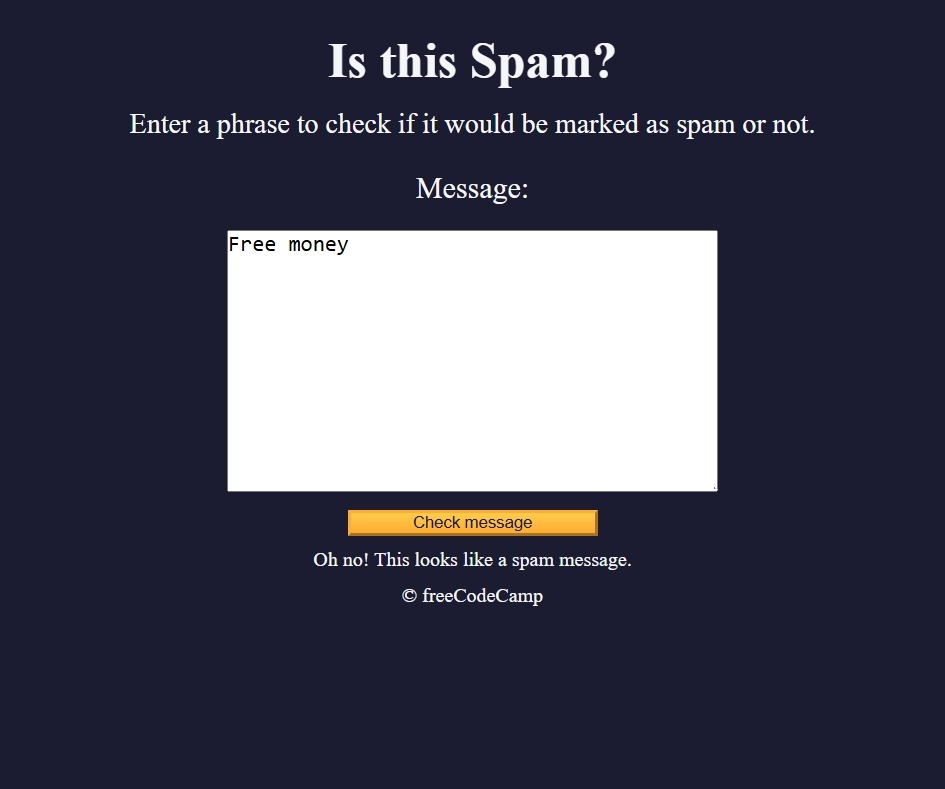

# Project Title

*An interactive storytelling app built with vanilla JavaScript.*

---

## 🚀 Live Demo

[View Project](https://himanshu-kumar-2301.github.io/project-name/)

---

## 🛠️ Tech Stack

- HTML5
- CSS3
- JavaScript (ES6+)

---

## 📸 Screenshots



---

## 📚 Features

- Feature 1: Brief description
- Feature 2: Brief description
- Feature 3: Brief description

---

## 📂 Project Structure

```code
root/  
|--index.html  
|--style.css  
|--script.js  
└--assets/  
     └--images/  
```

---

## 🧑‍💻 How to Run Locally

1. Clone the repo:

    ```bash
    git clone https://github.com/Himanshu-Kumar-2301/project-name.git
    ```

2. Navigate into the folder

    ```bash
    cd project-name
    ```

3. Open ```index.html``` in your browser.

## 📌 Future Improvements

- Add accessibility enhancements
- Improve mobile responsiveness
- Add more interactive features

## ℹ️ About
